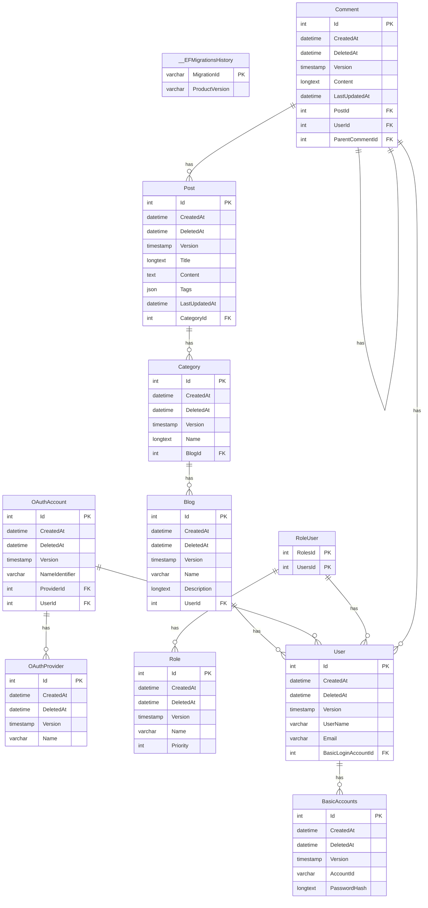

# BlogPlatform

ASP.NET Core로 구현하는 블로그 플랫폼 서비스 API

## 기능

- 회원가입/로그인/로그아웃/탈퇴
- 유저 이름 설정
- 카테고리 작성/수정/삭제
- 블로그 이름 설정
- 게시글 작성/수정/삭제
- 댓글 작성/수정/삭제
- 태그 작성/수정/삭제
- 게시글 검색
  - 카테고리
  - 제목
  - 내용
  - 댓글
  - 작성일
  - 수정일
  - 태그
- 댓글 검색
  - 작성자
  - 내용
  - 게시글
  - 작성일
  - 수정일

## 기술 스택

- ASP.NET Core 8.0
- Entity Framework Core 8.0
- MySQL
- Redis
- Docker

## ERD

