# IdentityController sequence diagram

## BasicLogin

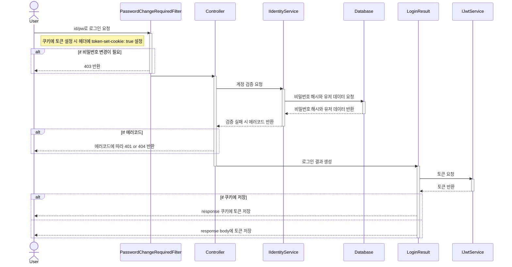

## BasicSignUp

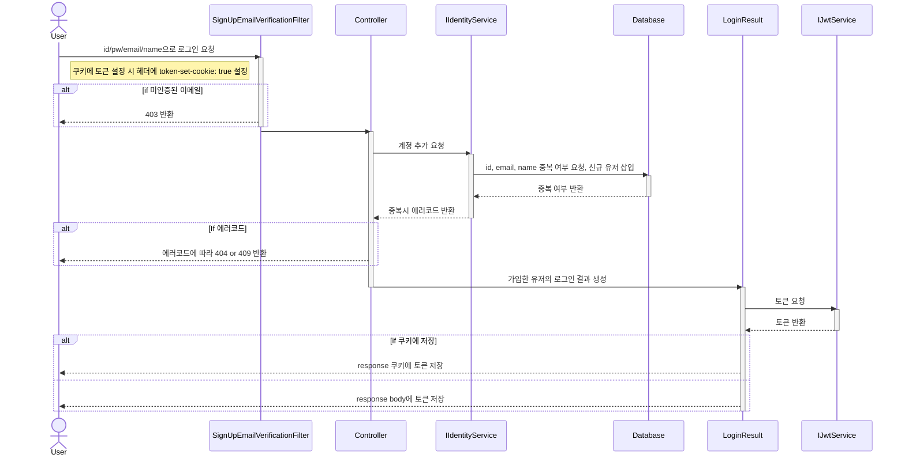

## SendVerifyEmail

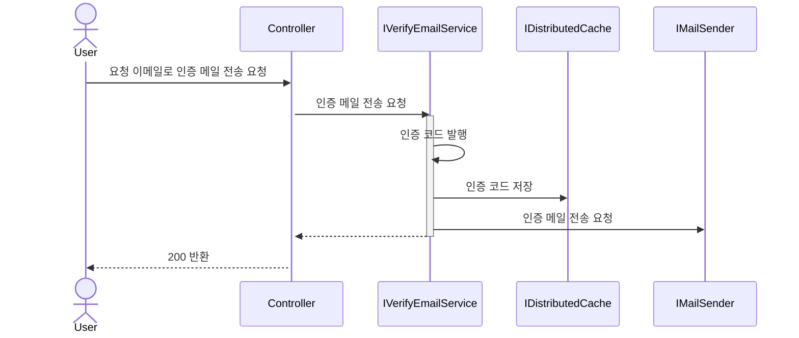

## VerifyEmail

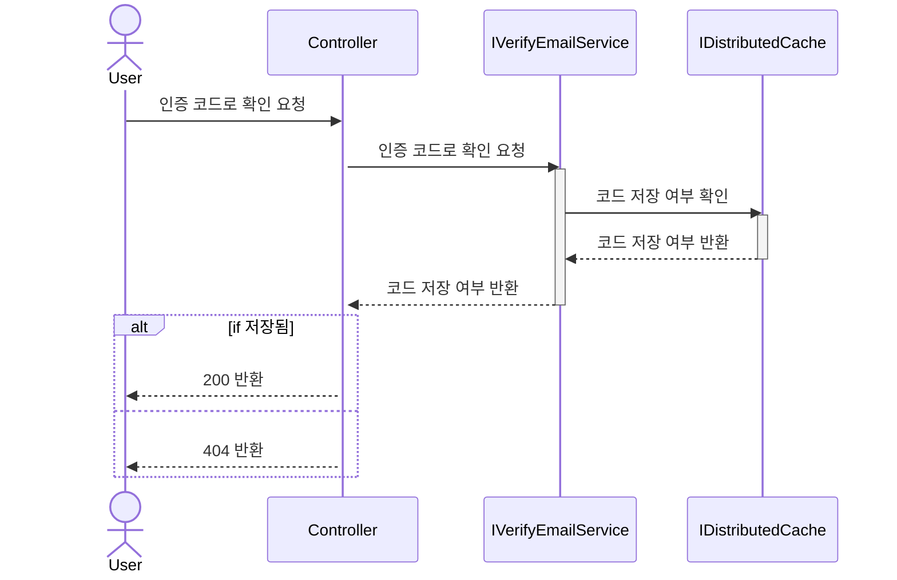

## OAuthLogin

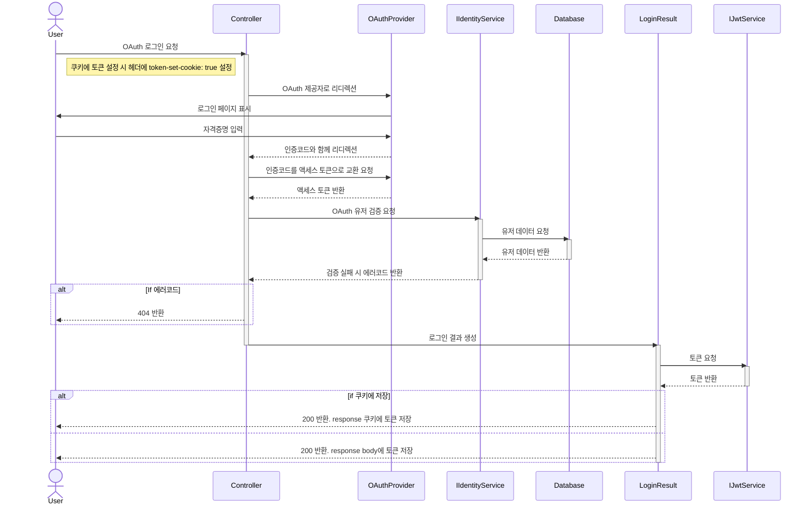

## OAuthSignUp

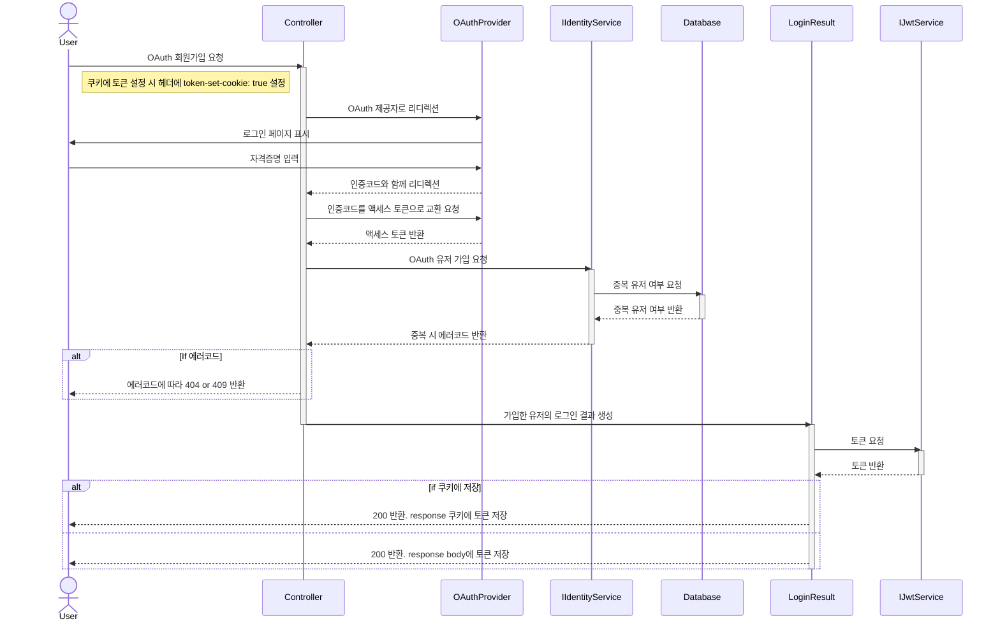

## AddOAuth

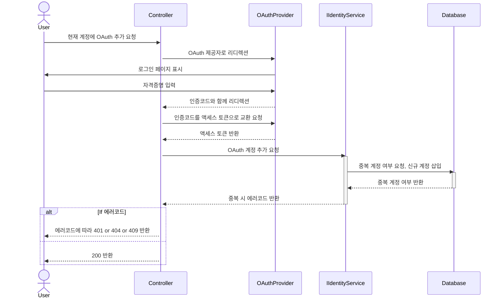

## RemoveOAuth

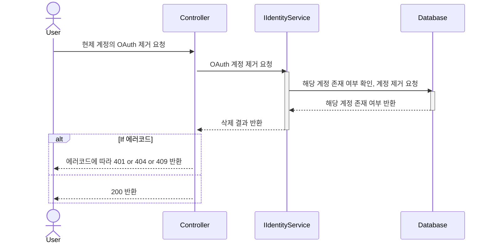

## Logout

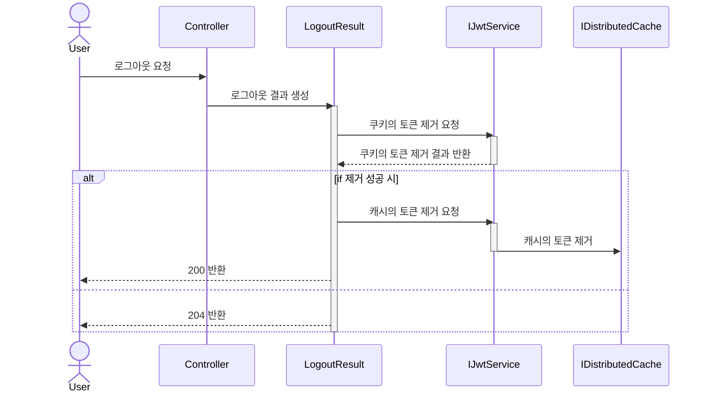

## Refresh

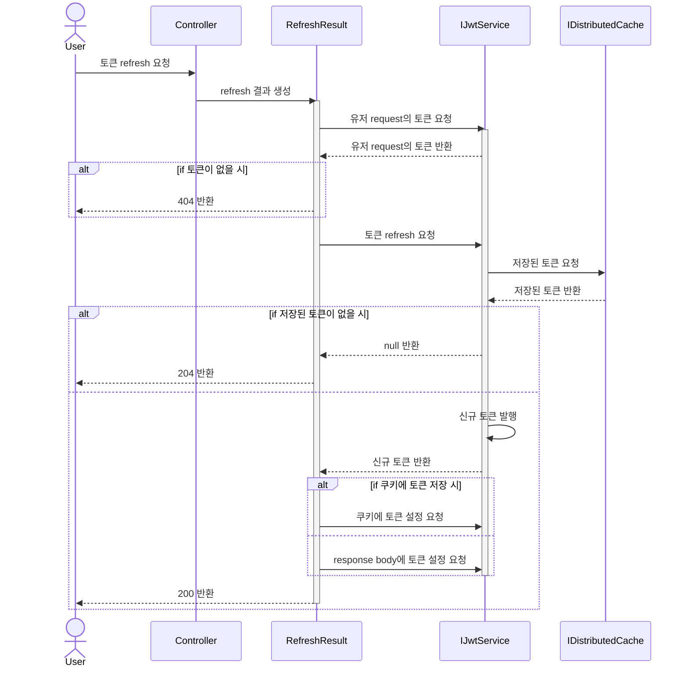

## ChangePassword

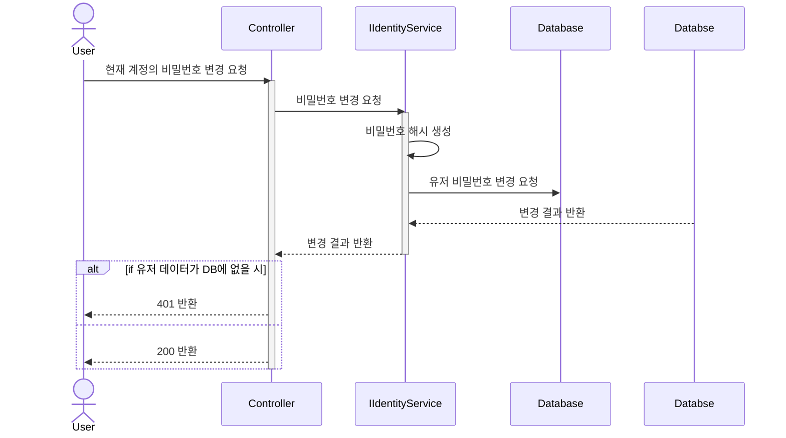

## ChangeName

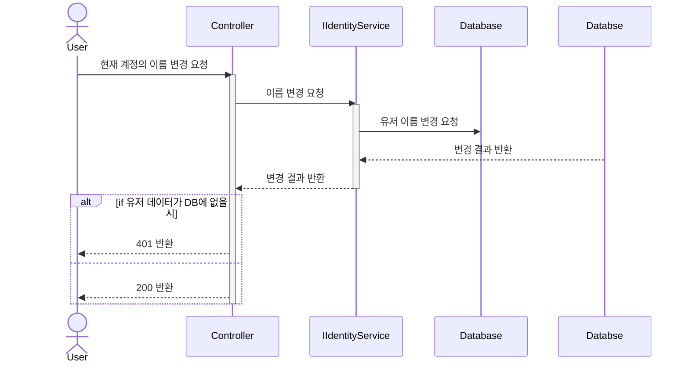

## ResetPassword

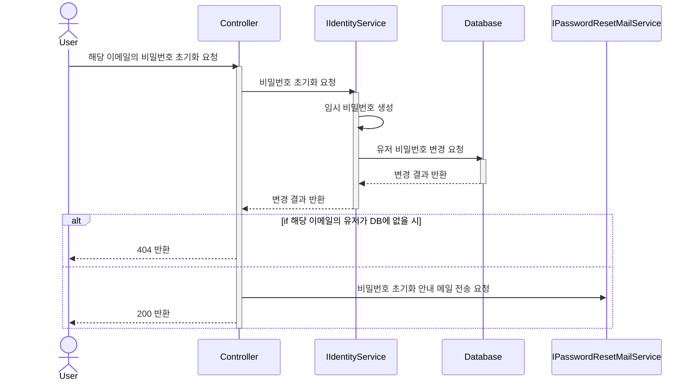
