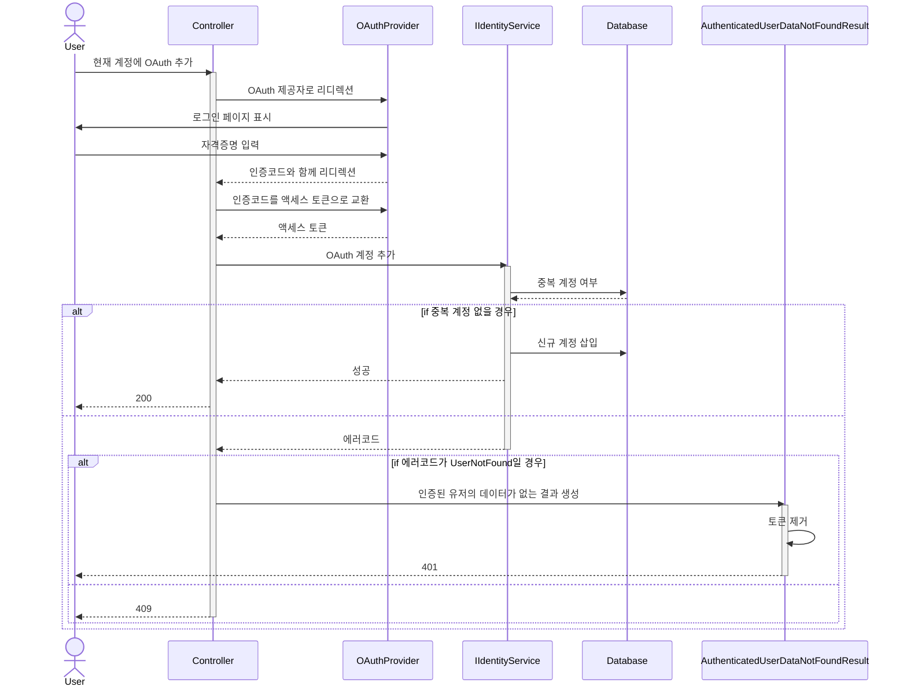

# AddOAuth

```mermaid
sequenceDiagram
    actor User
    participant Controller
    participant OAuthProvider
    participant IIdentityService
    participant Database
    participant AuthenticatedUserDataNotFoundResult

    User->>Controller: 현재 계정에 OAuth 추가
    activate Controller
    Controller->>OAuthProvider: OAuth 제공자로 리디렉션
    OAuthProvider->>User: 로그인 페이지 표시
    User->>OAuthProvider: 자격증명 입력
    OAuthProvider-->>Controller: 인증코드와 함께 리디렉션
    Controller->>OAuthProvider: 인증코드를 액세스 토큰으로 교환
    OAuthProvider-->>Controller: 액세스 토큰
    Controller->>IIdentityService: OAuth 계정 추가
    activate IIdentityService
    IIdentityService->>Database: 중복 계정 여부
    Database-->>IIdentityService: 
    alt if 중복 계정 없을 경우
        IIdentityService->>Database: 신규 계정 삽입
        IIdentityService-->>Controller: 성공
        Controller-->>User: 200
    else
        IIdentityService-->>Controller: 에러코드
        deactivate IIdentityService
        alt if 에러코드가 UserNotFound일 경우
            Controller->>AuthenticatedUserDataNotFoundResult: 인증된 유저의 데이터가 없는 결과 생성
            activate AuthenticatedUserDataNotFoundResult
            AuthenticatedUserDataNotFoundResult->>AuthenticatedUserDataNotFoundResult: 토큰 제거
            AuthenticatedUserDataNotFoundResult-->>User: 401
            deactivate AuthenticatedUserDataNotFoundResult
        else
            Controller-->>User: 409
            deactivate Controller
        end
    end
```
