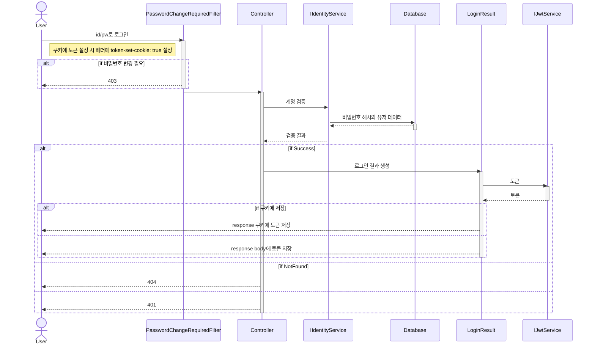

# BasicLogin

```mermaid
sequenceDiagram
    actor User
    participant PasswordChangeRequiredFilter
    participant Controller
    participant IIdentityService
    participant Database
    participant LoginResult
    participant IJwtService

    User->>PasswordChangeRequiredFilter: id/pw로 로그인
    activate PasswordChangeRequiredFilter
    Note right of User: 쿠키에 토큰 설정 시 헤더에 token-set-cookie: true 설정
    alt if 비밀번호 변경 필요
        PasswordChangeRequiredFilter-->>User: 403
    end
    deactivate PasswordChangeRequiredFilter

    PasswordChangeRequiredFilter->>Controller: 
    activate Controller
    Controller->>IIdentityService: 계정 검증
    activate IIdentityService
    IIdentityService->>Database: 비밀번호 해시와 유저 데이터
    activate Database
    Database-->>IIdentityService: 
    deactivate Database
    IIdentityService-->>Controller: 검증 결과

    alt if Success
        Controller->>LoginResult: 로그인 결과 생성
        activate LoginResult
        LoginResult->>IJwtService: 토큰
        activate IJwtService
        IJwtService-->>LoginResult: 토큰
        deactivate IJwtService
        alt if 쿠키에 저장
            LoginResult-->>User: response 쿠키에 토큰 저장
        else
            LoginResult-->>User: response body에 토큰 저장
        end
        deactivate LoginResult
    else if NotFound
        Controller-->>User: 404
    else
        Controller-->>User: 401
    end
    deactivate Controller
```
