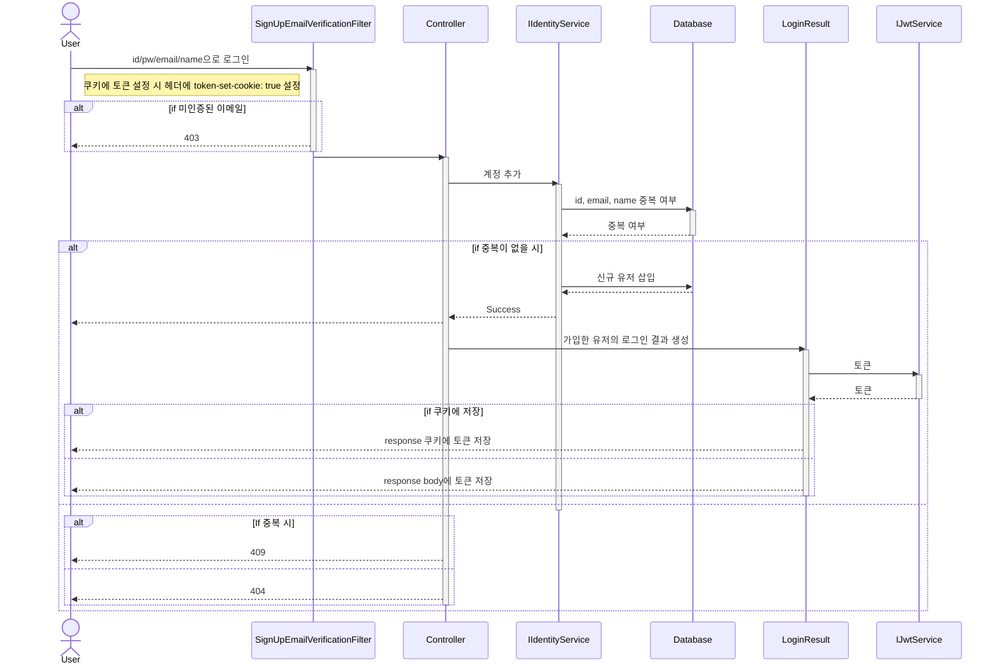

# BasicSignUp

```mermaid
sequenceDiagram
    actor User
    participant SignUpEmailVerificationFilter
    participant Controller
    participant IIdentityService
    participant Database
    participant LoginResult
    participant IJwtService

    User->>SignUpEmailVerificationFilter: id/pw/email/name으로 로그인
    activate SignUpEmailVerificationFilter
    Note right of User: 쿠키에 토큰 설정 시 헤더에 token-set-cookie: true 설정
    alt if 미인증된 이메일
        SignUpEmailVerificationFilter-->>User: 403
    end

    deactivate SignUpEmailVerificationFilter
    SignUpEmailVerificationFilter->>Controller: 
    activate Controller
    Controller->>IIdentityService: 계정 추가
    activate IIdentityService
    IIdentityService->>Database: id, email, name 중복 여부
    
    activate Database
    Database-->>IIdentityService: 중복 여부
    deactivate Database

    alt if 중복이 없을 시
    IIdentityService->>Database: 신규 유저 삽입
    Database-->>IIdentityService: 
    IIdentityService-->>Controller: Success
    Controller-->>User: 
    Controller->>LoginResult: 가입한 유저의 로그인 결과 생성
    activate LoginResult
    LoginResult->>IJwtService: 토큰
    activate IJwtService
    IJwtService-->>LoginResult: 토큰
    deactivate IJwtService
    alt if 쿠키에 저장
        LoginResult-->>User: response 쿠키에 토큰 저장
    else
        LoginResult-->>User: response body에 토큰 저장
    end
    deactivate LoginResult
    else
        deactivate IIdentityService
        alt If 중복 시
            Controller-->>User: 409
        else
            Controller-->>User: 404
        end
    deactivate Controller
    end
```
