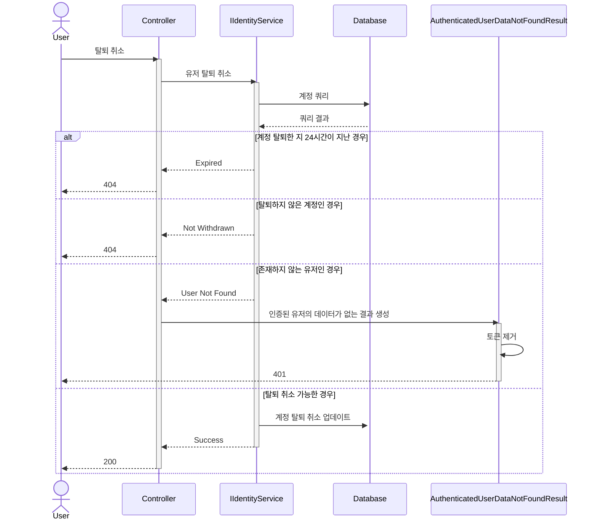

# CancelWithDraw

```mermaid
sequenceDiagram
    actor User
    participant Controller
    participant IIdentityService
    participant Database
    participant AuthenticatedUserDataNotFoundResult

    User->>Controller: 탈퇴 취소
    activate Controller
    Controller->>IIdentityService: 유저 탈퇴 취소
    activate IIdentityService
    IIdentityService->>Database: 계정 쿼리
    activate Database
    Database-->>IIdentityService: 쿼리 결과
   
    alt 계정 탈퇴한 지 24시간이 지난 경우
        IIdentityService-->>Controller: Expired
        Controller-->>User: 404
    else 탈퇴하지 않은 계정인 경우
        IIdentityService-->>Controller: Not Withdrawn
        Controller-->>User: 404
    else 존재하지 않는 유저인 경우
        IIdentityService-->>Controller: User Not Found
        Controller->>AuthenticatedUserDataNotFoundResult: 인증된 유저의 데이터가 없는 결과 생성
        activate AuthenticatedUserDataNotFoundResult
        AuthenticatedUserDataNotFoundResult->>AuthenticatedUserDataNotFoundResult: 토큰 제거
        AuthenticatedUserDataNotFoundResult-->>User: 401
        deactivate AuthenticatedUserDataNotFoundResult
    else 탈퇴 취소 가능한 경우
        IIdentityService->>Database: 계정 탈퇴 취소 업데이트
        IIdentityService-->>Controller: Success
        deactivate IIdentityService
        Controller-->>User: 200
        deactivate Controller
    end
```
