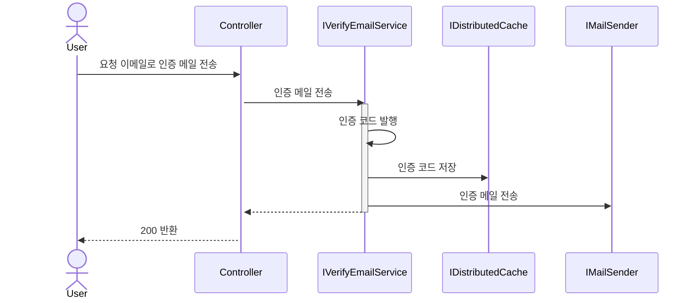

# ChangeEmail

```mermaid
sequenceDiagram
    actor User
    participant Controller
    participant IVerifyEmailService
    participant IDistributedCache
    participant IMailSender

    User->>Controller: 요청 이메일로 인증 메일 전송
    activate Controller
    Controller->>IVerifyEmailService: 인증 메일 전송
    activate IVerifyEmailService
    IVerifyEmailService->>IVerifyEmailService: 인증 코드 발행
    IVerifyEmailService->>IDistributedCache: 인증 코드 저장
    IVerifyEmailService->>IMailSender: 인증 메일 전송
    IVerifyEmailService-->>Controller: 
    deactivate IVerifyEmailService
    Controller-->>User: 200 반환
```
