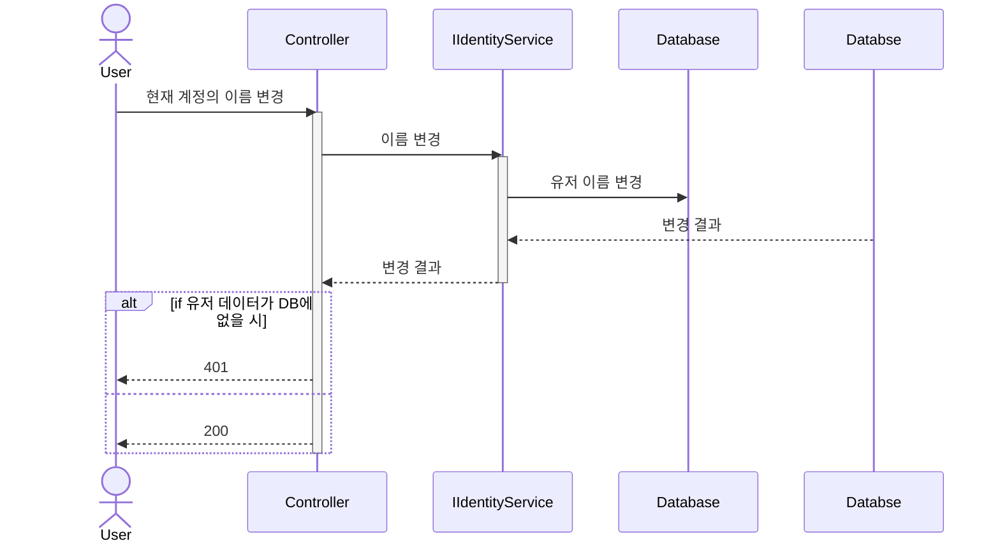

# ChangeName

```mermaid
sequenceDiagram
    actor User
    participant Controller
    participant IIdentityService
    participant Database

    User->>Controller: 현재 계정의 이름 변경
    activate Controller
    Controller->>IIdentityService: 이름 변경
    activate IIdentityService
    IIdentityService->>Database: 유저 이름 변경
    Databse-->>IIdentityService: 변경 결과
    IIdentityService-->>Controller: 변경 결과
    deactivate IIdentityService
    alt if 유저 데이터가 DB에 없을 시
        Controller-->>User: 401
    else
        Controller-->>User: 200
    end
    deactivate Controller
```
