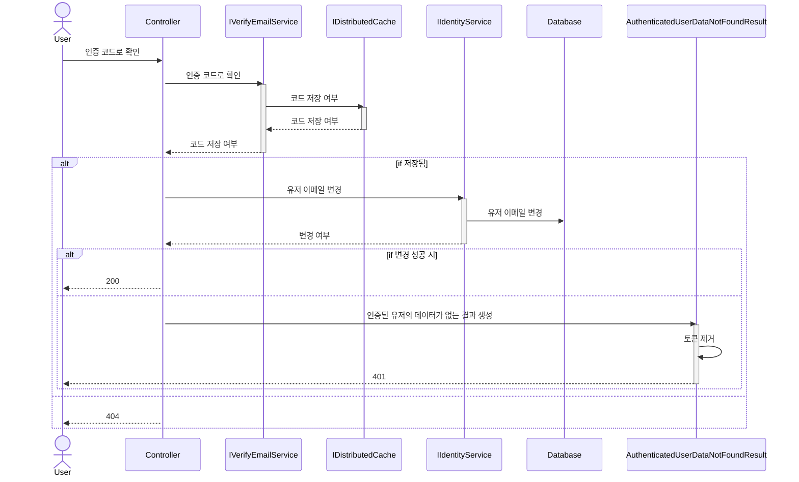

# ConfirmChangeEmail

```mermaid
sequenceDiagram
    actor User
    participant Controller
    participant IVerifyEmailService
    participant IDistributedCache
    participant IIdentityService
    participant Database
    participant AuthenticatedUserDataNotFoundResult

    User->>Controller: 인증 코드로 확인
    activate Controller
    Controller->>IVerifyEmailService: 인증 코드로 확인
    activate IVerifyEmailService
    IVerifyEmailService->>IDistributedCache: 코드 저장 여부
    activate IDistributedCache
    IDistributedCache-->>IVerifyEmailService: 코드 저장 여부
    deactivate IDistributedCache
    IVerifyEmailService-->>Controller: 코드 저장 여부
    deactivate IVerifyEmailService
    alt if 저장됨
        Controller->>IIdentityService: 유저 이메일 변경
        activate IIdentityService
        IIdentityService->>Database: 유저 이메일 변경
        IIdentityService-->>Controller: 변경 여부
        deactivate IIdentityService
        alt if 변경 성공 시
            Controller-->>User: 200
        else
            Controller->>AuthenticatedUserDataNotFoundResult: 인증된 유저의 데이터가 없는 결과 생성
            activate AuthenticatedUserDataNotFoundResult
            AuthenticatedUserDataNotFoundResult->>AuthenticatedUserDataNotFoundResult: 토큰 제거
            AuthenticatedUserDataNotFoundResult-->>User: 401
            deactivate AuthenticatedUserDataNotFoundResult
        end
    else
        Controller-->>User: 404
    end
```
