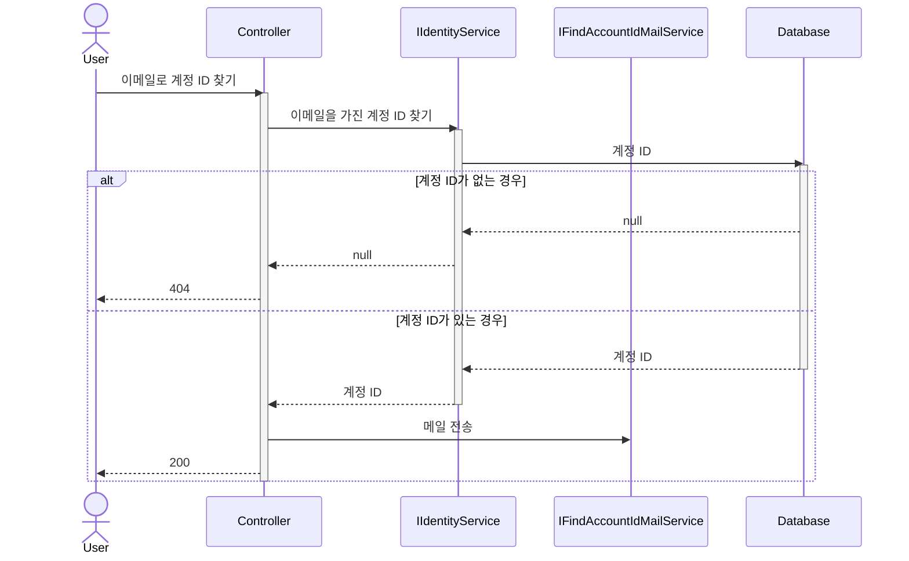

# FindId

```mermaid
sequenceDiagram
   actor User
   participant Controller
   participant IIdentityService
   participant IFindAccountIdMailService
   participant Database

   User->>Controller: 이메일로 계정 ID 찾기
   activate Controller
   Controller->>IIdentityService: 이메일을 가진 계정 ID 찾기
   activate IIdentityService
   IIdentityService->>Database: 계정 ID
   activate Database
   alt 계정 ID가 없는 경우
       Database-->>IIdentityService: null
       IIdentityService-->>Controller: null
       Controller-->>User: 404
   else 계정 ID가 있는 경우
       Database-->>IIdentityService: 계정 ID
       deactivate Database
       IIdentityService-->>Controller: 계정 ID
       deactivate IIdentityService
       Controller->>IFindAccountIdMailService: 메일 전송
       Controller-->>User: 200
   end
   deactivate Controller
```
