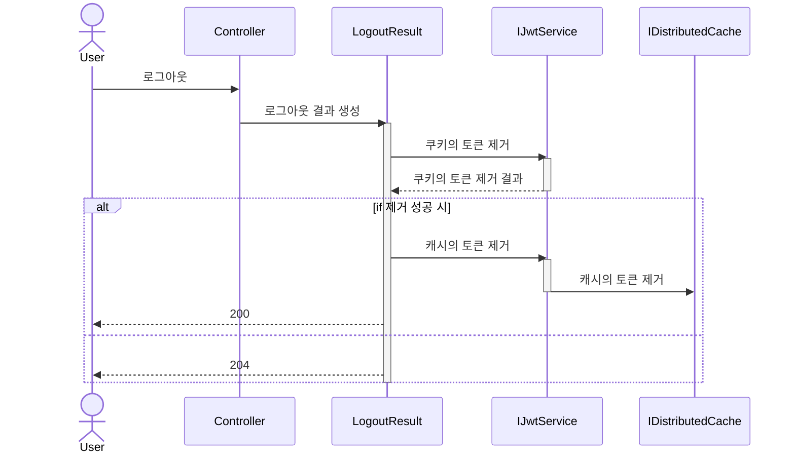

# Logout

```mermaid
sequenceDiagram
    actor User
    participant Controller
    participant LogoutResult
    participant IJwtService
    participant IDistributedCache

    User->>Controller: 로그아웃
    Controller->>LogoutResult: 로그아웃 결과 생성
    activate LogoutResult
    LogoutResult->>IJwtService: 쿠키의 토큰 제거
    activate IJwtService
    IJwtService-->>LogoutResult: 쿠키의 토큰 제거 결과
    deactivate IJwtService
    alt if 제거 성공 시
        LogoutResult->>IJwtService: 캐시의 토큰 제거
        activate IJwtService
        IJwtService->>IDistributedCache: 캐시의 토큰 제거
        deactivate IJwtService
        LogoutResult-->>User: 200
    else
        LogoutResult-->>User: 204
    end
    deactivate LogoutResult
```
