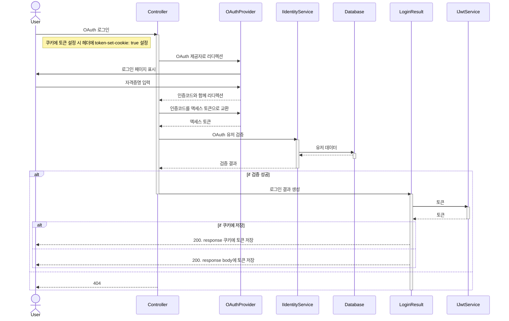

# OAuthLogin

```mermaid
sequenceDiagram
    actor User
    participant Controller
    participant OAuthProvider
    participant IIdentityService
    participant Database
    participant LoginResult
    participant IJwtService

    User->>Controller: OAuth 로그인
    activate Controller
    Note right of User: 쿠키에 토큰 설정 시 헤더에 token-set-cookie: true 설정
    Controller->>OAuthProvider: OAuth 제공자로 리디렉션
    OAuthProvider->>User: 로그인 페이지 표시
    User->>OAuthProvider: 자격증명 입력
    OAuthProvider-->>Controller: 인증코드와 함께 리디렉션
    Controller->>OAuthProvider: 인증코드를 액세스 토큰으로 교환
    OAuthProvider-->>Controller: 액세스 토큰
    Controller->>IIdentityService: OAuth 유저 검증
    activate IIdentityService
    IIdentityService->>Database: 유저 데이터
    activate Database
    Database-->>IIdentityService: 
    deactivate Database

    IIdentityService-->>Controller: 검증 결과
    deactivate IIdentityService

    alt if 검증 성공
    Controller->>LoginResult: 로그인 결과 생성
    deactivate Controller
    activate LoginResult
    LoginResult->>IJwtService: 토큰
    activate IJwtService
    IJwtService-->>LoginResult: 토큰
    deactivate IJwtService
    alt if 쿠키에 저장
        LoginResult-->>User: 200. response 쿠키에 토큰 저장
    else
        LoginResult-->>User: 200. response body에 토큰 저장
    end
    else
        Controller-->>User: 404
    end

    deactivate LoginResult
```
