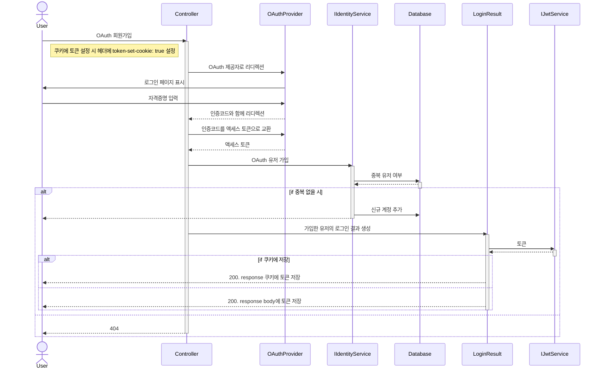

# OAuthSignUp

```mermaid
sequenceDiagram
    actor User
    participant Controller
    participant OAuthProvider
    participant IIdentityService
    participant Database
    participant LoginResult
    participant IJwtService

    User->>Controller: OAuth 회원가입
    activate Controller
    Note right of User: 쿠키에 토큰 설정 시 헤더에 token-set-cookie: true 설정
    Controller->>OAuthProvider: OAuth 제공자로 리디렉션
    OAuthProvider->>User: 로그인 페이지 표시
    User->>OAuthProvider: 자격증명 입력
    OAuthProvider-->>Controller: 인증코드와 함께 리디렉션
    Controller->>OAuthProvider: 인증코드를 액세스 토큰으로 교환
    OAuthProvider-->>Controller: 액세스 토큰
    Controller->>IIdentityService: OAuth 유저 가입
    activate IIdentityService
    IIdentityService->>Database: 중복 유저 여부
    activate Database
    Database-->>IIdentityService: 
    deactivate Database

    alt if 중복 없을 시
        IIdentityService->>Database: 신규 계정 추가
        IIdentityService-->>User: 
        deactivate IIdentityService

        Controller->>LoginResult: 가입한 유저의 로그인 결과 생성
        activate LoginResult
        LoginResult->>IJwtService: 토큰
        activate IJwtService
        IJwtService-->>LoginResult: 
        deactivate IJwtService
        alt if 쿠키에 저장
            LoginResult-->>User: 200. response 쿠키에 토큰 저장
        else
            LoginResult-->>User: 200. response body에 토큰 저장
        end
        deactivate LoginResult
    else
        Controller-->>User: 404
        deactivate Controller
    end
```
