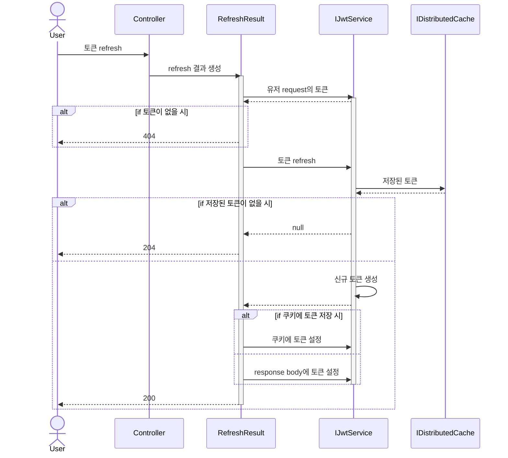

# Refresh

```mermaid
sequenceDiagram
    actor User
    participant Controller
    participant RefreshResult
    participant IJwtService
    participant IDistributedCache

    User->>Controller: 토큰 refresh
    Controller->>RefreshResult: refresh 결과 생성
    activate RefreshResult
    RefreshResult->>IJwtService: 유저 request의 토큰
    activate IJwtService
    IJwtService-->>RefreshResult: 
    alt if 토큰이 없을 시
        RefreshResult-->>User: 404
    end

    RefreshResult->>IJwtService: 토큰 refresh
    IJwtService->>IDistributedCache: 저장된 토큰
    IDistributedCache-->>IJwtService: 
    alt if 저장된 토큰이 없을 시
        IJwtService-->>RefreshResult: null
        RefreshResult-->>User: 204
    else
        IJwtService->>IJwtService: 신규 토큰 생성
        IJwtService-->>RefreshResult: 
        alt if 쿠키에 토큰 저장 시
            RefreshResult->>IJwtService: 쿠키에 토큰 설정
        else
            RefreshResult->>IJwtService: response body에 토큰 설정
        end
        deactivate IJwtService
        RefreshResult-->>User: 200
        deactivate RefreshResult
    end
```
