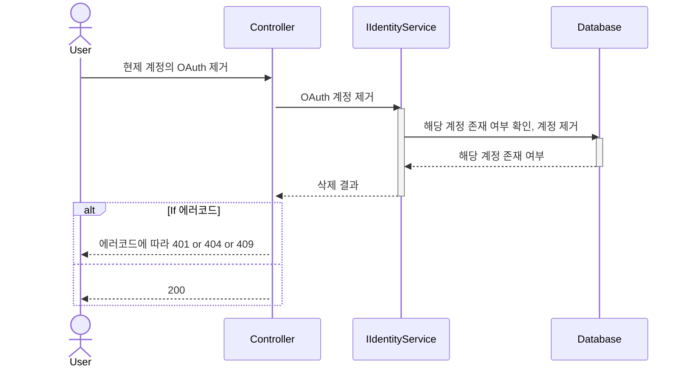

# RemoveOAuth

```mermaid
sequenceDiagram
    actor User
    participant Controller
    participant IIdentityService
    participant Database

    User->>Controller: 현제 계정의 OAuth 제거
    activate Controller
    Controller->>IIdentityService: OAuth 계정 제거
    activate IIdentityService
    IIdentityService->>Database: 해당 계정 존재 여부 확인, 계정 제거
    activate Database
    Database-->>IIdentityService: 해당 계정 존재 여부
    deactivate Database
    IIdentityService-->>Controller: 삭제 결과
    deactivate IIdentityService
    alt If 에러코드
        Controller-->>User: 에러코드에 따라 401 or 404 or 409
    else
        Controller-->>User: 200
    end
```
