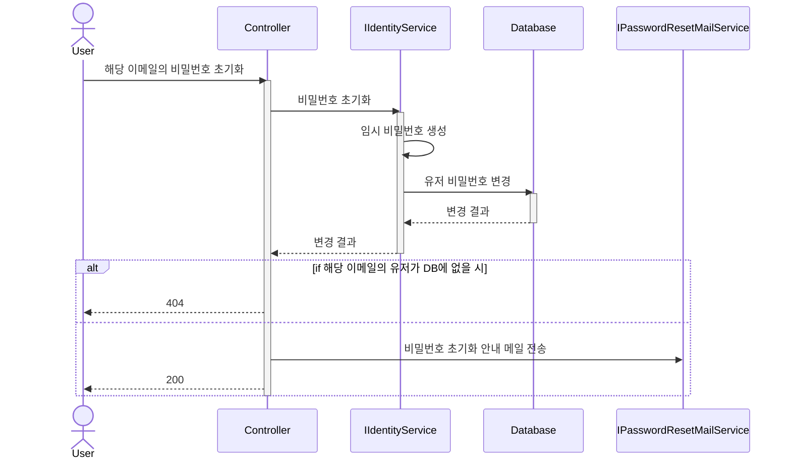

# ResetPassword

```mermaid
sequenceDiagram
    actor User
    participant Controller
    participant IIdentityService
    participant Database
    participant IPasswordResetMailService

    User->>Controller: 해당 이메일의 비밀번호 초기화
    activate Controller
    Controller->>IIdentityService: 비밀번호 초기화
    activate IIdentityService
    IIdentityService->>IIdentityService: 임시 비밀번호 생성
    IIdentityService->>Database: 유저 비밀번호 변경
    activate Database
    Database-->>IIdentityService: 변경 결과
    deactivate Database
    IIdentityService-->>Controller: 변경 결과
    deactivate IIdentityService
    alt if 해당 이메일의 유저가 DB에 없을 시
        Controller-->>User: 404
    else
        Controller->>IPasswordResetMailService: 비밀번호 초기화 안내 메일 전송
        Controller-->>User: 200
    end
    deactivate Controller
```
