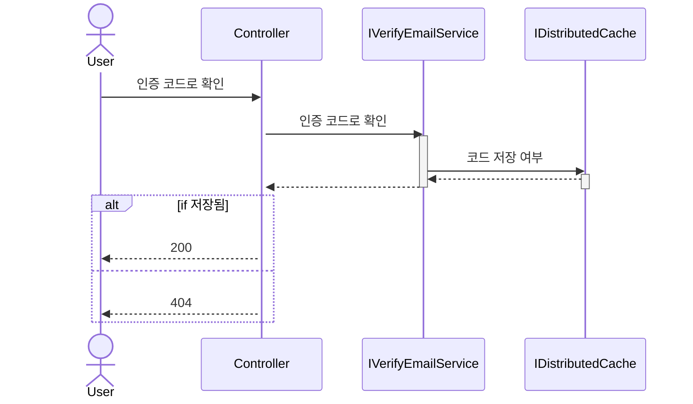

# VerifyEmail

```mermaid
sequenceDiagram
    actor User
    participant Controller
    participant IVerifyEmailService
    participant IDistributedCache

    User->>Controller: 인증 코드로 확인
    activate Controller
    Controller->>IVerifyEmailService: 인증 코드로 확인
    activate IVerifyEmailService
    IVerifyEmailService->>IDistributedCache: 코드 저장 여부
    activate IDistributedCache
    IDistributedCache-->>IVerifyEmailService: 
    deactivate IDistributedCache
    IVerifyEmailService-->>Controller: 
    deactivate IVerifyEmailService
    alt if 저장됨
        Controller-->>User: 200
    else
        Controller-->>User: 404
    end
```
