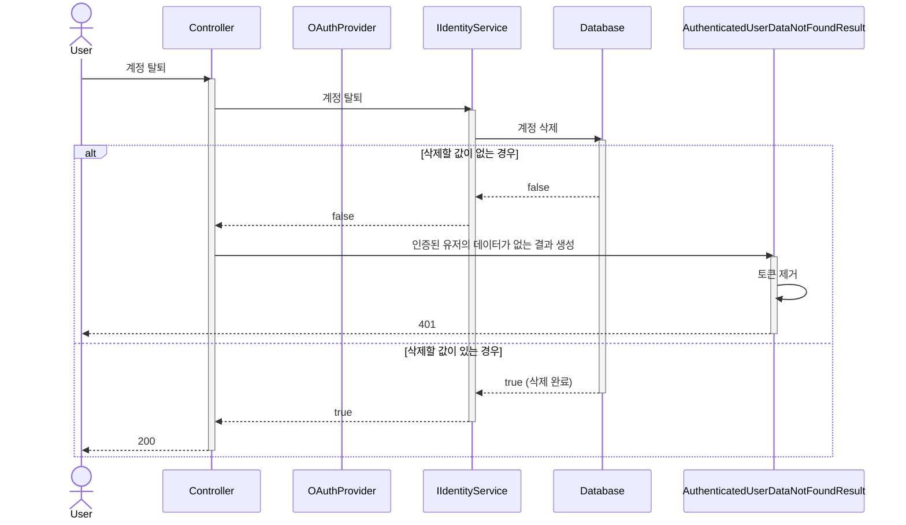

# WithDraw

```mermaid
sequenceDiagram
    actor User
    participant Controller
    participant OAuthProvider
    participant IIdentityService
    participant Database
    participant AuthenticatedUserDataNotFoundResult

    User->>Controller: 계정 탈퇴
    activate Controller
    Controller->>IIdentityService: 계정 탈퇴
    activate IIdentityService
    IIdentityService->>Database: 계정 삭제
    activate Database
    alt 삭제할 값이 없는 경우
        Database-->>IIdentityService: false
        IIdentityService-->>Controller: false
        Controller->>AuthenticatedUserDataNotFoundResult: 인증된 유저의 데이터가 없는 결과 생성
        activate AuthenticatedUserDataNotFoundResult
        AuthenticatedUserDataNotFoundResult->>AuthenticatedUserDataNotFoundResult: 토큰 제거
        AuthenticatedUserDataNotFoundResult-->>User: 401
        deactivate AuthenticatedUserDataNotFoundResult
    else 삭제할 값이 있는 경우
        Database-->>IIdentityService: true (삭제 완료)
        deactivate Database
        IIdentityService-->>Controller: true
        deactivate IIdentityService
        Controller-->>User: 200
        deactivate Controller
    end
```
